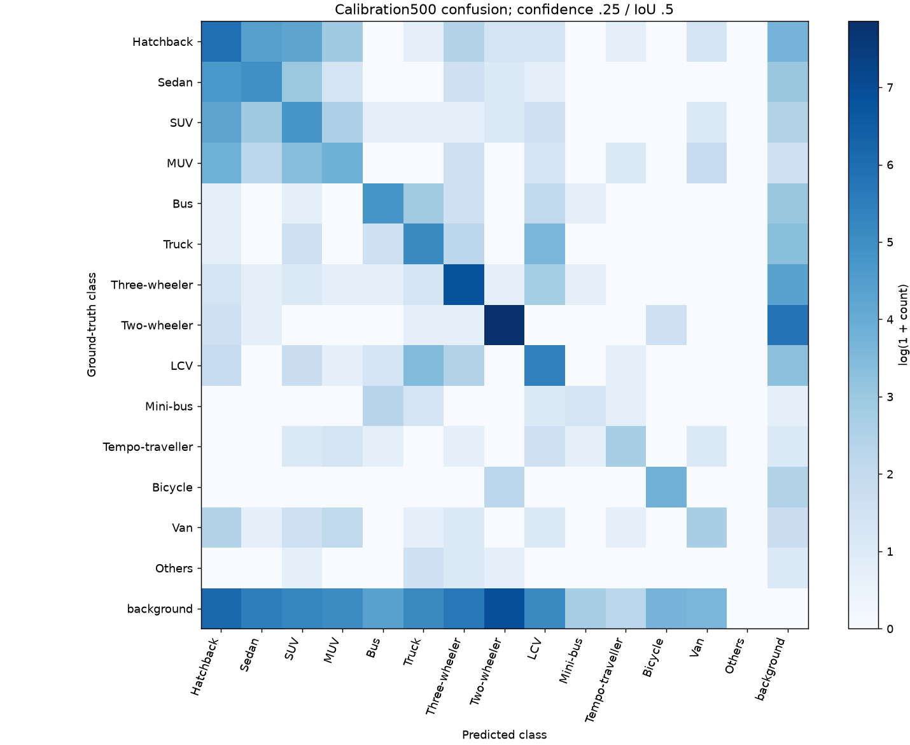
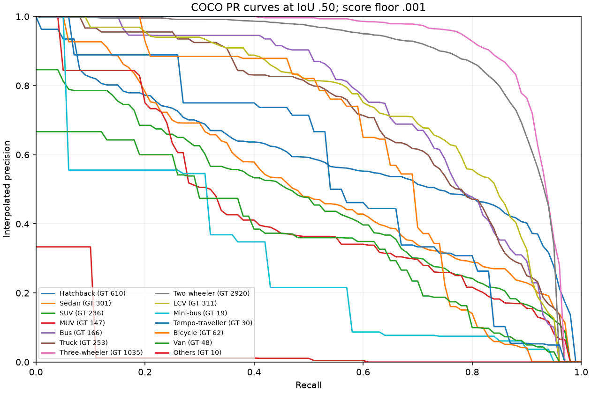
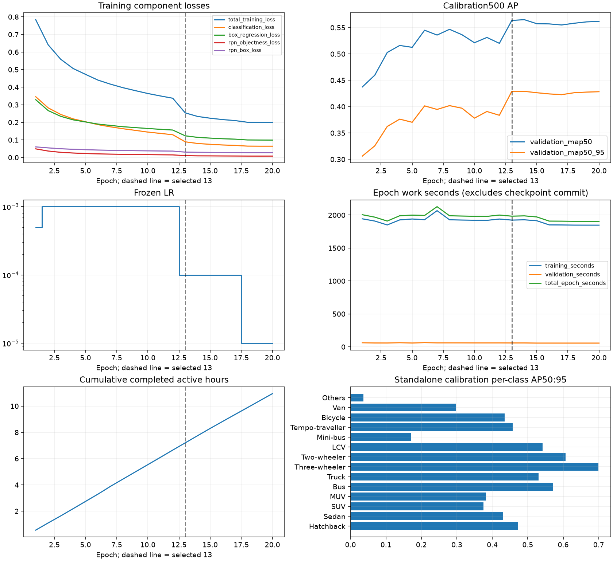

# E3 standalone calibration closeout — Accuracy Stage D

E3 completed **20/20 epochs, final exit 0**. Epoch **13** is frozen as the selected checkpoint. This independent evaluation uses only **calibration500**, the same set used to select the checkpoint. It is configuration-selection evidence, not an independent test result. E3 has **not** been fairly compared with E1. Reserved1500 was not accessed in Stage D and remains unused under the new comparison protocol; fusion remains unstarted.

## Completed-run audit

Run `E3_fasterrcnn_unweighted_20ep_seed42_v1`; UUID `f92b8c3236f74270860f5ada5f8a0980`. Original launch commit `7985af2607220282a6f3269d5af353e2e8e86329`; recovery commit `3a9586b929d4c9f7892d7fd8630c7dc3c7298290`. COMPLETE timestamp `2026-09-23T05:33:00.816393+00:00`. The original epoch-6 alias-publication failure is historical: the validated same-run recovery resumed at epoch 7 and completed successfully. Both session records and failure evidence are retained.

[Audit](../../reports/evaluations/E3_fasterrcnn_best_calibration500_v1/audit.json) verifies original/executed source hashes against Git commits, configuration/manifest/mapping/official initializer hashes, all 20 checkpoint receipts, 160,000 finite component-loss steps, readable finite best/last model and optimizer states, matching embedded timing histories and 20 unique contiguous CSV rows. No retraining, overwrite or deletion occurred. [Historical preservation](../../reports/evaluations/E3_fasterrcnn_best_calibration500_v1/historical_preservation.json) checks 72 E0/E1/E2 artifact/config hashes against Stage B evidence.

Checkpoint paths are relative to `runs/E3_fasterrcnn_unweighted_20ep_seed42_v1/`:

| Checkpoint | Epoch | Bytes | SHA-256 |
|---|---:|---:|---|
| best.pth | 13 | 330600285 | `2d035a95206475b1e9939c5686a731a2427f84918389a2aa4d59148ed5ba5df9` |
| last.pth | 20 | 330602781 | `ae975e629e85125ee19605af7ee9d308fa9684a99f6c3f3e2302f6274690bd89` |

Frozen configuration: official COCO_V1 Faster R-CNN ResNet-50-FPN; 15 outputs (background + 14); train8000/calibration500; unweighted deterministic shuffle, seed42; MPS float32, batch1, workers0; short-side480/max640; no augmentation; SGD momentum .9, weight decay .0005. LR .0005 at epoch1, .001 at 2–12, .0001 at 13–17, .00001 at 18–20. Hash details remain in the audit, including initializer SHA `258fb6c638b15964ddcdd1ae0748c5eef1be9e732750120cc857feed3faac384`.

## Independent evaluator

Immutable bundle `runs/E3_fasterrcnn_best_calibration500_v1/`; committed summaries under `reports/evaluations/E3_fasterrcnn_best_calibration500_v1/`. Export contains 500 images, 6,148 GT objects and 42,811 raw predictions (8,423 at confidence ≥.25). Forward/export + metric computation: **59.081 s**, including **57.659 s** prediction collection; excludes audit/model loading/benchmark/plots. [Environment](../../reports/evaluations/E3_fasterrcnn_best_calibration500_v1/environment.json), [frozen protocol/source hashes](../../reports/evaluations/E3_fasterrcnn_best_calibration500_v1/protocol.json), [metrics](../../reports/evaluations/E3_fasterrcnn_best_calibration500_v1/metrics.json).

| Precision | Recall | Harmonic aggregate F1 | Macro class F1 | AP50 | AP50:95 |
|---:|---:|---:|---:|---:|---:|
| 0.456161 | 0.634882 | 0.530884 | 0.526259 | 0.563561 | 0.429070 |

Fixed-threshold metrics: confidence **.25**, matching IoU **.50**, per-class descending-score greedy matching. Precision/recall are macro means over GT-supported classes; zero predictions yield precision zero. Harmonic aggregate F1 = 2×macroP×macroR/(macroP+macroR); macro F1 averages the 14 individual class F1 values. Confusion matrix instead uses class-agnostic score-descending matching at the same thresholds, rows GT/columns prediction with a background row/column. Consequently its diagonal need not equal the class-aware TP total.

AP integrates COCO precision-recall at IoUs .50:.05:.95 using model score floor .001 (not the .25 fixed threshold), NMS .50 and maxDets [1,10,300]. PR curves display COCO interpolated precision at IoU .50. Predeclared absolute agreement tolerance **1e-5**: P/R/AP50/AP50:95 differences from epoch 13 are **all exactly zero**. No metrics were adjusted. [Agreement](../../reports/evaluations/E3_fasterrcnn_best_calibration500_v1/agreement.json).

## Per-class results and errors

All values below are calibration-only; prediction counts use confidence .25. Raw counts also exist in [CSV](../../reports/evaluations/E3_fasterrcnn_best_calibration500_v1/per_class.csv).

| Class | GT support | Predictions | Precision | Recall | F1 | AP50 | AP50:95 |
|---|---:|---:|---:|---:|---:|---:|---:|---:|
| Hatchback | 610 | 1082 | 0.4621 | 0.8197 | 0.5910 | 0.5995 | 0.4717 |
| Sedan | 301 | 492 | 0.3923 | 0.6412 | 0.4868 | 0.5250 | 0.4310 |
| SUV | 236 | 438 | 0.3539 | 0.6568 | 0.4599 | 0.4653 | 0.3753 |
| MUV | 147 | 247 | 0.3320 | 0.5578 | 0.4162 | 0.4414 | 0.3824 |
| Bus | 166 | 210 | 0.5905 | 0.7470 | 0.6596 | 0.7355 | 0.5720 |
| Truck | 253 | 402 | 0.4925 | 0.7826 | 0.6046 | 0.7038 | 0.5306 |
| Three-wheeler | 1035 | 1263 | 0.7419 | 0.9053 | 0.8155 | 0.9092 | 0.6995 |
| Two-wheeler | 2920 | 3615 | 0.7137 | 0.8836 | 0.7896 | 0.8781 | 0.6066 |
| LCV | 311 | 474 | 0.5380 | 0.8199 | 0.6497 | 0.7369 | 0.5416 |
| Mini-bus | 19 | 20 | 0.3500 | 0.3684 | 0.3590 | 0.2987 | 0.1702 |
| Tempo-traveller | 30 | 28 | 0.5714 | 0.5333 | 0.5517 | 0.5615 | 0.4577 |
| Bicycle | 62 | 88 | 0.4886 | 0.6935 | 0.5733 | 0.6289 | 0.4346 |
| Van | 48 | 64 | 0.3594 | 0.4792 | 0.4107 | 0.3645 | 0.2972 |
| Others | 10 | 0 | 0.0000 | 0.0000 | 0.0000 | 0.0415 | 0.0365 |

Three-wheeler (1,035 objects) and Two-wheeler (2,920) are strongest by AP50:95. Bus (166) is next. Others has zero recall and no predictions above .25, despite nonzero integrated AP at lower confidence; support is only 10. Mini-bus (19) and Van (48) are also weak. Small support makes these estimates sensitive to individual objects; no single rare class establishes a general advantage. Macro AP weights classes equally despite unequal support.

Class-aware totals: **5113 TP, 3310 FP, 1035 FN**. Among misses, 23/72 original-area-small GT objects (<32² px) and 113/429 resized-small GT objects (<16² px) were missed. These two definitions overlap and must not be added. Geometric diagnostics flag 411 duplicate candidates and 486 localization candidates; these are diagnostic proxies, not adjudicated mutually exclusive FP causes. Common confusion directions: Sedan → Hatchback (111), Hatchback → Sedan (82), SUV → Hatchback (71), Hatchback → SUV (68), MUV → Hatchback (45). See [error summary](../../reports/evaluations/E3_fasterrcnn_best_calibration500_v1/error_summary.json), [per-image diagnostics](../../reports/evaluations/E3_fasterrcnn_best_calibration500_v1/image_errors.json), [confusion matrix](../../reports/evaluations/E3_fasterrcnn_best_calibration500_v1/confusion_matrix.json).

## Qualitative review

Thirteen deterministic calibration-only panels cover maximum GT density, small boxes, two-/three-wheelers, buses/trucks, each selected rare category, overlapping boxes, misses, false positives and a sparse scene. Ranking maximizes the named count with image-ID tie breaking; sparse selects minimum positive GT count. This is purposeful coverage, not a random prevalence sample. [Selection](../../reports/evaluations/E3_fasterrcnn_best_calibration500_v1/qualitative_selection.json) and [image-by-image visual observations](../../reports/evaluations/E3_fasterrcnn_best_calibration500_v1/qualitative_review.json); large GT/prediction side-by-side JPEGs stay in the ignored local bundle.

Correct foreground detections coexist with redundant overlapping boxes, passenger-vehicle confusion, poor localization and small/occluded misses. Image 7790 contains a clear large false truck box over a foreground camera/support structure; 11427 correctly detects its single cropped edge vehicle without extra empty-road detections. Dense 21566 visually confirms occlusion; box overlap alone was only a selection proxy.

Source limitations are separate: in 18073 a covered object is labeled Sedan but visible appearance cannot establish its identity; Others includes handcart-like objects. Some distant unmatched detections may correspond to unannotated objects, but that is unadjudicated. No labels or frozen annotations were modified; all metrics use original GT.

## Batch-one MPS benchmark

Deterministic seed42 sample of 100 calibration images, 10 warm-ups, one timed pass, Apple M5, MPS float32, batch1, resize short480/max640, confidence .25/NMS .50/max300. Stage boundaries synchronize MPS. Parameter count **41,365,786**; selected recovery checkpoint **330,600,285 bytes** (contains optimizer/recovery state, not an inference-only weight export). Model construction/loading **0.510 s**, excluded below. Split-forward predictions were checked against the normal forward path.

| Stage (ms) | Mean | Median | p95 |
|---|---:|---:|---:|
| preprocessing | 28.308 | 28.248 | 29.658 |
| inference | 84.597 | 83.088 | 93.068 |
| postprocessing | 1.423 | 1.400 | 1.563 |
| end_to_end | 114.329 | 112.901 | 122.450 |

Inference-only **11.821 images/s**; end-to-end **8.747 still images/s**, each inverse mean stage time. Preprocessing includes file decode, tensor/device transfer, normalization/resize/padding. Inference includes backbone/RPN/RoI heads **and internal box decoding/NMS**. Postprocessing maps boxes to original resolution, transfers to CPU and applies .25 confidence. End-to-end sums these stages; excludes loading, prior integrity hashes, metrics, capture/display and logging. Warm filesystem/model, one pass: no live-video FPS or production claim and no historical YOLO speed comparison.

Memory sampled after each image: maximum allocated **191,055,872 bytes**, driver **1,243,283,456 bytes**. These are sampled MPS readings, not peak memory or total application/RSS usage. [Protocol/results](../../reports/evaluations/E3_fasterrcnn_best_calibration500_v1/benchmark.json), [sample](../../reports/evaluations/E3_fasterrcnn_best_calibration500_v1/benchmark_sample.json), [per-image timings](../../reports/evaluations/E3_fasterrcnn_best_calibration500_v1/benchmark_samples.csv).

## Training and time

Loss fell from **0.784235 to 0.199220**, with finite component losses throughout. AP50:95 rose from .306132 at epoch1 to .429070 at epoch13. The first LR reduction coincided with .383583 → .429070 at epochs12→13; this association is not a causal ablation. Later AP plateaued: epoch17 .422721, epoch18 .426376, epoch20 .428324. Epoch20 remained .000747 below the selected epoch13, despite lower training loss. The second LR reduction did not produce a new best checkpoint.

Completed-epoch active time **39,407.971 s (10 h 56 m 48 s)**; calendar first-session-to-completion **41,721.797 s (11 h 35 m 22 s)**. Difference **2,313.826 s** includes between-session delay, startup and checkpoint overhead; it must not be labeled all compute or all sleep. Epoch mean **1970.399 s**, sample SD **53.552 s**, range **1904.356–2127.975 s** (31.74–35.47 min). Training/validation/total/cumulative seconds and exact LR are in [all 20 rows](../../reports/evaluations/E3_fasterrcnn_best_calibration500_v1/epoch_timing.csv); checkpoint publication is excluded by the original timing policy.

## Delivery, limitations and next gate

[Reproduction/validation commands](../reproducibility/E3_STANDALONE_CALIBRATION.md), [faculty briefing](../faculty_review/E3_STAGE_D_SUMMARY.md), artifact index `artifact_index.json`, and validation evidence `validation.json` reside alongside these summaries. All **184 deliverable tests passed (6.00 s)**, including six new evaluator/artifact tests. Ruff passed on all six new Python files; the dashboard AppTest rendered without exceptions and the local checkpoint/manifest/artifact validator passed. Structured results are in `tests_summary.json`; raw test output stays in the ignored local bundle. No large predictions, local image renders, weights, logs or runs are eligible for Git.

This is one seed and one hardware session, selected and re-evaluated on calibration500. E1 remains the historical selected YOLO detector, pending a fair matched E1/E3 comparison. Reserved1500 remains unused by the new protocol, but it was drawn from the historical validation pool; it is not a never-seen independent test set. The 26,646-image annotation-catalogue audit differs from the 10,000-image local integrity audit; unselected-image acquisition/integrity is still incomplete. Stage D is complete; a separately authorized frozen matched comparison is the next scientific step. Reserved evaluation, E1 comparison, fusion and further training were **not started**.
