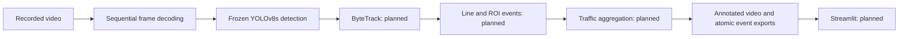

# Phase 3 architecture and initial configuration

## Scope and implementation boundary

Phase 3 builds a video traffic analytics prototype around frozen E1 YOLOv8s-640. Initial delivery implements configuration and detector-only streaming video smoke. Tracking, counting, analytics, UI and real-video evaluation are planned interfaces, not completed capabilities. No detector training occurs.

## Frozen configuration

`configs/phase3_video.yaml` pins checkpoint path and SHA-256, model, imgsz640, MPS with explicit CPU fallback, confidence .25, NMS .7, max_det300, seed42, input/output paths, immutable run ID, frame/time bounds and rendering mode. Paths are project-relative. CLI overrides are captured in each run snapshot. Invalid checkpoint, hash, class mapping, geometry, confidence or run ID fails clearly. CPU fallback applies only when MPS is unavailable; runtime MPS errors preserve failure evidence instead of silently changing device.

`configs/phase3_bytetrack.yaml` proposes default ByteTrack thresholds for the next stage; current video smoke does not instantiate it. High/low association thresholds .25/.10, new track threshold .25, buffer30, match threshold .8. These are initial manual settings, not optimized or validated traffic parameters.

## Module contracts

The detector adapter returns finite Nx6 arrays: xyxy, confidence, class ID. Model weights and ordered 14-class names are verified before inference. Synthetic unit tests inject a clearly labelled fake detector; CLI always uses the real frozen adapter. No raw detections are called tracks or counted vehicles.

The future tracker adapter should produce stable session-local IDs, latest box/confidence, center history, first/last frame, confirmed observation age and confidence-weighted class votes. It must handle empty detections and bounded absence, reject malformed outputs and remove expired tracks. IDs are not permanent physical identities. Tests must cover association continuity and misses before enabling counting.

Future line logic uses a bottom-center anchor and signed cross product against normalized endpoints, converted to source pixels. Default line runs (0.1,0.5) to (0.9,0.5). Negative-to-positive side is A_to_B, reverse B_to_A; incoming/outgoing labels require scene calibration. Three confirmed observations, 5-pixel hysteresis and at most one count per track per direction are proposed. Segment intersection must lie on the finite line, not merely its infinite extension. ROI is optional and currently disabled. Absence gaps need explicit continuity policy; never extrapolate an unseen crossing without evidence. Class ID/name freeze at event creation from accumulated votes.

Events will carry event ID, source timestamp/frame, track ID, frozen class, direction, confidence, crossing coordinates, input identifier and run identifier. CSV and JSON publication should use temporary files and atomic rename. Aggregation must distinguish unique confirmed tracks from crossings and compute per-class/direction/minute flow, rolling flow, duration and occupancy. Density thresholds must be documented as manual unless derived from labelled data. Speed and physical distance are out of scope without calibration.

## Streaming, failure and timing semantics

`src/video/pipeline.py` reads one frame at a time and retains timing scalars, not video frames. Start offsets are decoded sequentially to avoid inaccurate codec seeks. Source is never modified. Existing output directories are refused. Frame failures stop the run and retain FAILURE.json, snapshot, available timings and partial video. Unknown decoder length limits distinction between EOF and premature termination; backend-reported source frame count is not independently guaranteed. No unread frames are silently counted as processed.

The current writer uses mp4v, preserves source FPS and verifies encoder availability. Browser support varies; a later dashboard may require a separately documented H.264 delivery conversion. Handles release in finally blocks. Output finalization is included in processing wall time; source hashing/model loading are excluded. First-frame startup is included, with no warm-up removal. Detector-stage time includes model preprocessing/postprocessing and cannot be labelled pure forward-pass inference. MPS timing is synchronized. No tracking/analytics timing is yet available.

Future benchmarks must separately measure rendering/encoding enabled and disabled on the same legally supplied road clip, report all stages and failures, and compare sustained achieved FPS against source FPS. Synthetic smoke FPS is not that benchmark.

## Evaluation and data boundary

No suitable local road clip was found. Needed: 2–5 owned or otherwise legally usable Indian urban-road clips, 30–120 seconds each, stable camera, clear crossing direction and several vehicle classes. Record licence/permission and attribution before use. No arbitrary third-party download is authorized.

Manual crossing GT schema: video_id, frame or timestamp_seconds, direction, class_id/name, notes. An example header is provided in `docs/phase_reports/PHASE_3_MANUAL_EVENTS.csv`. Ground truth must be independently reviewed; an empty template is not annotation. Count error is absolute(predicted−actual), percentage error is 100*absolute_error/actual; when actual=0 percentage error is undefined, with false events reported separately. Event-level false/missed matching requires a declared temporal tolerance and one-to-one class/direction agreement. Tracking metrics require tracking GT; no IDF1/HOTA/ID-switch score is currently supported.

## Next implementation stages

After suitable clips are supplied: implement/test ByteTrack adapter, general line/ROI state machine, atomic exports and aggregation; then connect the same backend to Streamlit. Run manual count evaluation and both sustained video benchmark modes. Each stage needs tests, progress evidence and normal Git delivery. No Phase 3 completion claim until these criteria pass.
